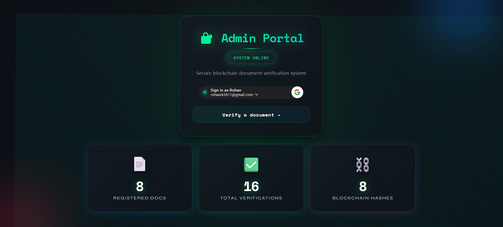
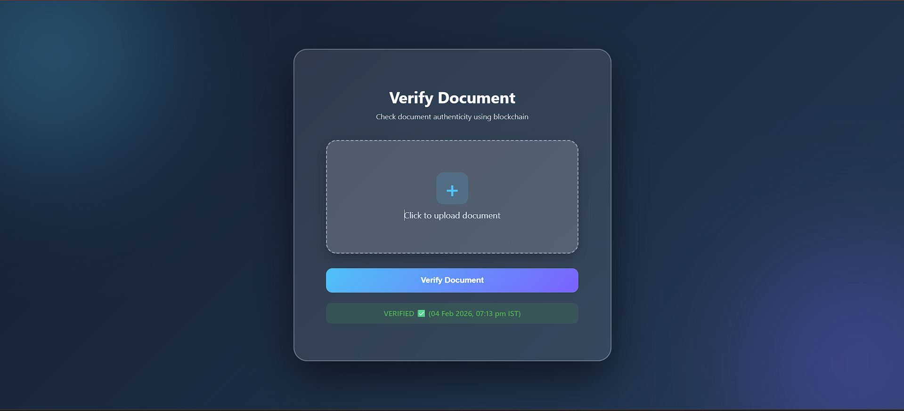
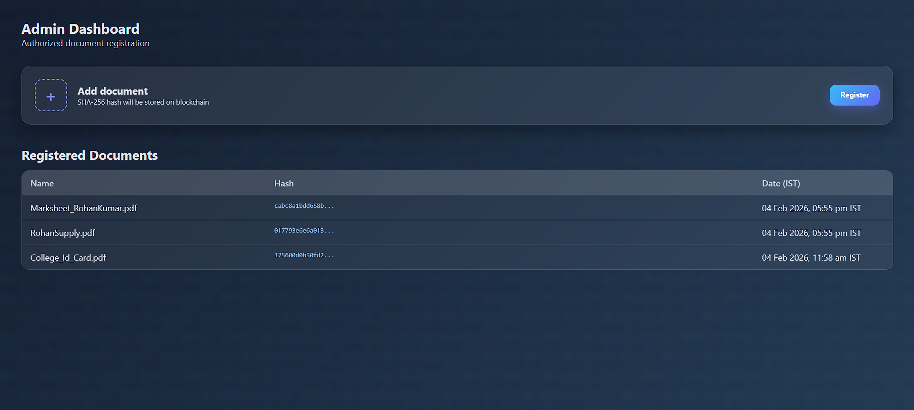

# 🔐 Blockchain Document Verification System

---

## 🚀 Overview

A *decentralized, tamper-proof document verification platform* that uses:

- SHA-256 hashing
- Blockchain anchoring (Ethereum)
- MongoDB metadata
- Secure file storage
- Google OAuth admin access

This system ensures:

✅ No document tampering  
✅ Immutable proof  
✅ Transparent verification  
✅ Trustless architecture  

---

## ✨ Features

### 👨‍💼 Admin
- Google login
- Upload & register documents
- Duplicate detection (hash-based)
- Blockchain anchoring
- View history dashboard
- Live stats

### 🌍 Public
- Verify documents without login
- Instant authenticity check
- Timestamped blockchain proof

### 📊 Analytics
- Total registered documents
- Total verifications
- Real-time stats

---

# 📸 Screenshots

## 🔐 Login Page

  

---

## ✅ Verify Page

  

---

## 📊 Admin Dashboard

  

---

# 🏗️ Architecture

React Frontend
      ↓
Spring Boot Backend
      ↓
SHA-256 Hash
      ↓
MongoDB (metadata)
      ↓
Ethereum Smart Contract (hash stored)
      ↓
Cloudinary / IPFS (file storage)

---

# 🛠️ Tech Stack

## Frontend
- ReactJS
- Axios
- Google OAuth
- Modern Glass UI

## Backend
- Spring Boot
- MongoDB
- JWT Auth
- Cloudinary Storage

## Blockchain
- Ethereum (Sepolia)
- Web3j
- Smart Contracts

---

# ⚙️ How It Works

## 📌 Register Flow

Upload file
   ↓
Generate SHA-256 hash
   ↓
Save metadata (MongoDB)
   ↓
Store hash on Blockchain
   ↓
Success

## 🔍 Verify Flow

Upload file
   ↓
Generate hash
   ↓
Compare with DB
   ↓
Validate on blockchain
   ↓
Verified / Tampered

---

# 🔧 Local Setup

## 1️⃣ Clone
bash
git clone https://github.com/BlackMagic95/blockChain-Document-Verification.git
cd blockChain-Document-Verification

---

## 2️⃣ Backend
bash
cd backend
./gradlew bootRun

Runs at:

http://localhost:8080

---

## 3️⃣ Frontend
bash
cd frontend
npm install
npm start

Runs at:

http://localhost:3000

---

# 🔑 Environment Variables

### application.properties

properties
spring.data.mongodb.uri=YOUR_MONGO_URL

blockchain.private-key=YOUR_PRIVATE_KEY
blockchain.contract=YOUR_CONTRACT_ADDRESS
blockchain.rpc=YOUR_RPC_URL

google.client-id=YOUR_GOOGLE_CLIENT_ID

---

# 📡 API Endpoints

## Auth
POST /auth/google

## Admin
POST /upload
GET /docs

## Public
POST /verify
GET /stats

---

# 📈 Project Highlights

✔ Blockchain anchored hashes  
✔ Duplicate prevention  
✔ Immutable verification  
✔ Clean dashboard UI  
✔ Real-time stats  
✔ Ready for IPFS integration  
✔ IEEE research ready  

---

# 🎯 Use Cases

- Academic certificates
- Government records
- Legal contracts
- HR onboarding
- Compliance audits
- Digital identity

---

# 🔮 Future Improvements

- IPFS decentralized storage
- Filecoin/Arweave support
- Batch blockchain anchoring
- Merkle tree optimization
- Zero-knowledge proofs
- Enterprise deployment
- IEEE publication

---

# 👨‍💻 Author

*Rohan Kumar*

GitHub → https://github.com/BlackMagic95  
LinkedIn → https://linkedin.com/in/rkrohankumar  

---

# ⭐ Support

If you like this project:

⭐ Star the repo  
🍴 Fork it  
🚀 Share it  

---

# 📜 License

MIT License
