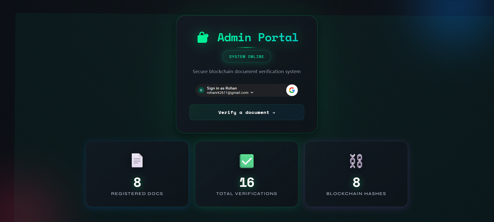
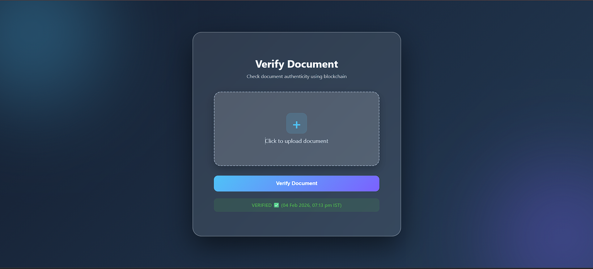
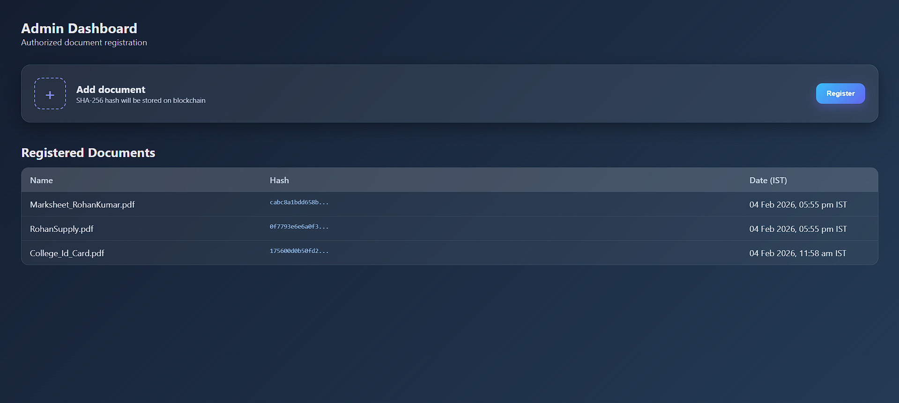
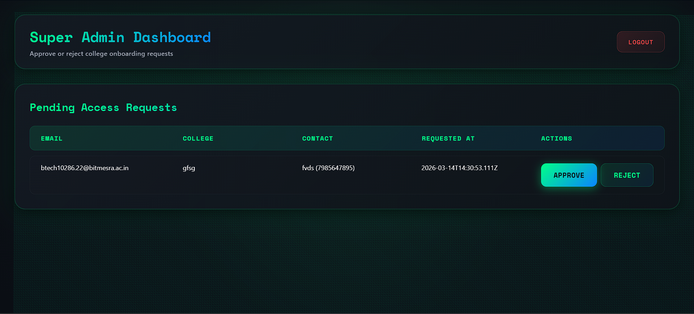
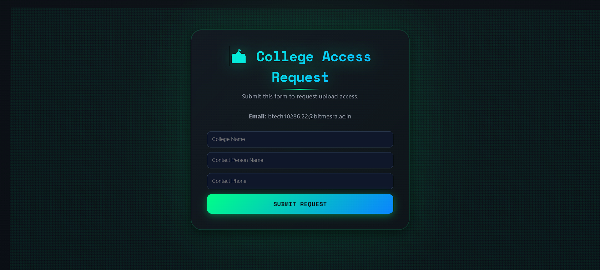

<div align="center">

# 🔐 Blockchain Document Verification System

### Trustless • Tamper-Proof • Decentralized


A **secure Web3 document verification platform** that ensures authenticity of certificates and official documents using **blockchain immutability, decentralized storage, and cryptographic hashing**.

</div>

---

# 📌 Problem

Traditional document verification systems suffer from:

• Centralized databases  
• Easily forgeable certificates  
• Manual verification processes  
• High trust dependency  
• Slow institutional validation

Fake certificates are becoming increasingly common.

---

# 💡 Solution

This platform introduces **trustless document verification** by combining:

| Technology     | Purpose                          |
| -------------- | -------------------------------- |
| Blockchain     | Immutable document hash registry |
| IPFS           | Decentralized file storage       |
| AES Encryption | Secure document protection       |
| SHA-256        | Cryptographic fingerprint        |
| MongoDB        | Metadata management              |
| JWT Auth       | Secure access control            |

This eliminates the need for a central authority to verify documents.

---

# ⚙️ Core Workflow

## Document Registration Flow

```
Admin Uploads Document
        ↓
SHA-256 Hash Generated
        ↓
AES-256 Encryption
        ↓
Encrypted File Uploaded to IPFS
        ↓
CID Stored in MongoDB
        ↓
Hash Registered on Ethereum Blockchain
        ↓
Document Permanently Verifiable
```

---

## Document Verification Flow

```
User Uploads Document
        ↓
System Generates SHA-256 Hash
        ↓
Check MongoDB Database
        ↓
Verify Hash on Blockchain
        ↓
Compare Hashes
        ↓
Return Verification Result
```

Possible results:

• VERIFIED  
• TAMPERED_DB  
• BLOCKCHAIN_ONLY  
• NOT_REGISTERED

---

# 🏗 System Architecture

```
                ┌───────────────┐
                │     User      │
                └───────┬───────┘
                        │
                        ▼
              ┌─────────────────┐
              │  React Frontend │
              └────────┬────────┘
                       │ API
                       ▼
             ┌───────────────────┐
             │ Spring Boot Server│
             └───────┬───────────┘
                     │
        ┌────────────┼─────────────┐
        ▼            ▼             ▼
   MongoDB        IPFS         Ethereum
  (Metadata)   (Encrypted)   (Hash Registry)
```

---

# 🔐 Security Architecture

Security is implemented in **multiple layers**.

### Authentication

Google OAuth + JWT

### Encryption

AES-256 encryption before file upload

### Hashing

SHA-256 cryptographic fingerprint

### Blockchain Integrity

Ethereum smart contract stores hashes

### Decentralized Storage

IPFS stores encrypted files

---

# 👨‍💼 Admin Portal

Authorized institutions can register documents.

Features:

• Google OAuth login  
• JWT session authentication  
• Document upload system  
• SHA-256 hashing  
• AES encryption  
• Blockchain registration  
• CSV export  
• Document management dashboard

---

# 🛡 Super Admin Panel

Super Admin controls access to the platform.

Capabilities:

• Approve college access requests  
• Reject suspicious institutions  
• Monitor platform activity  
• Manage issuer accounts

---

# 🏫 College Onboarding System

Institutions must apply before gaining access.

```
College submits request
        ↓
Stored as PENDING
        ↓
Super Admin review
        ↓
APPROVED or REJECTED
        ↓
Approved college receives access
```

This prevents unauthorized organizations from issuing documents.

---

# 🏢 Multi-Tenant College Isolation

The platform supports **multiple institutions securely**.

```
College A → sees only A documents
College B → sees only B documents
Super Admin → sees everything
```

Implemented using:

• collegeId metadata  
• scoped MongoDB queries  
• JWT-based authentication

---

# 🌐 Public Verification

Anyone can verify documents **without logging in**.

Steps:

1. Upload document
2. System generates hash
3. Compare with database
4. Validate against blockchain
5. Show authenticity result

---

# 📸 Screenshots

### Login Page



### Document Verification



### Admin Dashboard



### Super Admin Panel



### College Request Form



---

# 🧰 Tech Stack

## Frontend

React  
Vite  
Axios  
TailwindCSS

---

## Backend

Spring Boot  
Java 17  
JWT Authentication  
Swagger API Docs

---

## Blockchain

Solidity Smart Contract  
Web3j  
Ethereum Sepolia Testnet

---

## Storage

IPFS (Pinata)

---

## Database

MongoDB

---

## Deployment

Frontend → Vercel  
Backend → Render

CI/CD → GitHub push deployment

---

# 📡 API Endpoints

| Method | Endpoint        | Description             |
| ------ | --------------- | ----------------------- |
| POST   | /upload         | register document       |
| POST   | /verify         | verify document         |
| GET    | /docs           | list registered docs    |
| GET    | /download/{id}  | download decrypted file |
| GET    | /stats          | platform statistics     |
| POST   | /access/request | college access request  |

---

# 🚀 Quick Start

## Clone Repository

```bash
git clone https://github.com/BlackMagic95/blockChain-Document-Verification.git
cd blockChain-Document-Verification
```

---

## Backend Setup

```
cd backend
./gradlew bootRun
```

Backend runs at:

```
http://localhost:8080
```

---

## Frontend Setup

```
cd frontend
npm install
npm run dev
```

Frontend runs at:

```
http://localhost:5173
```

---

# 🐳 Docker (Optional)

```
docker build -t doc-verification .
docker run -p 8080:8080 doc-verification
```

---

# 📊 Project Highlights

This project demonstrates:

• Blockchain integration  
• Web3 architecture  
• Cryptographic security  
• Decentralized storage  
• Multi-tenant SaaS architecture  
• Modern full-stack development  
• CI/CD deployment pipelines

---

# 👨‍💻 Author

**Rohan Kumar**

GitHub  
https://github.com/BlackMagic95

---

# ⭐ Support

If you found this project useful, please give it a **star ⭐ on GitHub**.
