<div align="center">

# 🔐 Blockchain Document Verification System

### Trustless • Tamper-Proof • Decentralized

[](LICENSE)
[](https://www.java.com)
[](https://spring.io/projects/spring-boot)
[](https://reactjs.org)
[](https://www.mongodb.com)
[](https://ethereum.org)
[](https://ipfs.io)
[](https://www.docker.com)
[](#)

**A production-ready Web3 document verification platform leveraging blockchain immutability, decentralized storage, and military-grade encryption to ensure document authenticity.**

[🚀 Live Demo](#-live-demo) • [📖 Documentation](#-documentation) • [⚡ Quick Start](#-quick-start) • [🛠 Tech Stack](#-tech-stack)

</div>

---

## 🎯 Overview

Traditional document verification relies on centralized authorities that can be compromised, manipulated, or shut down. This system eliminates trust requirements through:

```
📄 Original Document
    ↓
🔐 AES-256 Encryption
    ↓
📦 IPFS Decentralized Storage
    ↓
⛓️ Ethereum Blockchain Hash Registry
    ↓
✅ Trustless Verification
```

**Key Innovation**: Even with public IPFS CIDs, documents remain unreadable due to AES encryption. Only authorized parties with proper credentials can decrypt and access the original content.

---

## ✨ Features

<table>
<tr>
<td width="50%">

### 👨‍💼 Admin Portal

- 🔑 Google OAuth 2.0 authentication
- 🔒 JWT-based session management
- 📤 Secure document upload & registration
- 🛡️ SHA-256 cryptographic hashing
- 🔐 AES-256 encryption pre-upload
- 📊 Real-time statistics dashboard
- 📈 Activity history & audit trails
- 📥 CSV export functionality
- 📱 Fully responsive design

</td>
<td width="50%">

### 🔍 Public Verification

- ⚡ Zero login required
- 🎯 Instant document validation
- ⛓️ Blockchain-backed authenticity
- 🚨 Tamper detection alerts
- 🔓 Secure decrypted downloads
- 🌐 Anonymous verification
- ⏱️ Real-time results
- 🔒 End-to-end security
- 📱 Mobile-friendly interface

</td>
</tr>
</table>

---

## 🌐 Live Demo

<div align="center">

|      Platform      | Link                                                                                                         |                           Status                            |
| :----------------: | :----------------------------------------------------------------------------------------------------------- | :---------------------------------------------------------: |
|  🨠**Frontend**   | [block-chain-document-verification-phi.vercel.app](https://block-chain-document-verification-phi.vercel.app) |  |
| ⚙️ **Backend API** | [blockchain-document-verification.onrender.com](https://blockchain-document-verification.onrender.com/docs)  |  |
|  📚 **API Docs**   | [Swagger UI](https://blockchain-document-verification.onrender.com/swagger-ui.html)                          |    |

> ⚠️ **Note**: Backend hosted on free tier - initial requests may take ~30 seconds to wake from sleep mode.

</div>

---

## 🏗️ System Architecture

```mermaid
graph TB
    A[👤 User] --> B[⚛️ React Frontend]
    B --> C[🍃 Spring Boot Backend]
    C --> D[🗄️ MongoDB]
    C --> E[📦 IPFS Network]
    C --> F[⛓️ Ethereum Blockchain]

    D -.->|Metadata| C
    E -.->|Encrypted Files| C
    F -.->|Hash Registry| C

    style A fill:#e1f5ff
    style B fill:#61dafb
    style C fill:#6db33f
    style D fill:#4db33d
    style E fill:#65c2cb
    style F fill:#8b5cf6
```



### Data Flow

```
┌─────────────────────────────────────────────────────────────┐
│                    REGISTRATION FLOW                        │
└─────────────────────────────────────────────────────────────┘

Document Upload
      ↓
Generate SHA-256 Hash
      ↓
AES-256 Encryption
      ↓
Upload to IPFS → CID Generated
      ↓
Store Metadata in MongoDB
      ↓
Register Hash on Ethereum
      ↓
✅ Document Registered


┌─────────────────────────────────────────────────────────────┐
│                    VERIFICATION FLOW                        │
└─────────────────────────────────────────────────────────────┘

Document Upload
      ↓
Generate SHA-256 Hash
      ↓
Query MongoDB
      ↓
Validate on Blockchain
      ↓
Compare Hashes
      ↓
✅ Authentic → Decrypt & Download
❌ Invalid → Tamper Detected
```

---

## 🔐 Security Architecture

### Multi-Layer Security Model

<table>
<tr>
<th>Layer</th>
<th>Technology</th>
<th>Purpose</th>
</tr>
<tr>
<td>🔑 Authentication</td>
<td>Google OAuth 2.0 + JWT</td>
<td>Secure admin access control</td>
</tr>
<tr>
<td>🔐 Encryption</td>
<td>AES-256-CBC</td>
<td>File content protection</td>
</tr>
<tr>
<td>🔏 Hashing</td>
<td>SHA-256</td>
<td>Document fingerprinting</td>
</tr>
<tr>
<td>⛓️ Immutability</td>
<td>Ethereum Blockchain</td>
<td>Tamper-proof registry</td>
</tr>
<tr>
<td>📦 Storage</td>
<td>IPFS</td>
<td>Decentralized file persistence</td>
</tr>
<tr>
<td>🛡️ API Security</td>
<td>JWT + CORS + Rate Limiting</td>
<td>Backend protection</td>
</tr>
</table>

### Encryption Workflow

```javascript
// What happens to your document:
Original File (readable.pdf)
    ↓
AES-256 Encryption with secret key
    ↓
Encrypted Binary (unreadable blob)
    ↓
Upload to IPFS → Public CID
    ↓
❌ CID is public, but file content is ENCRYPTED
✅ Only backend with AES key can decrypt
```

**This means**:

- ❌ IPFS gateway users cannot read the file
- ❌ Network sniffers get encrypted data only
- ❌ Unauthorized access is impossible
- ✅ Only authenticated downloads are decrypted

---

## 🛠️ Tech Stack

<div align="center">

### Frontend


### Backend


### Blockchain & Storage


### Database & DevOps


</div>

---

## 📡 API Reference

### Core Endpoints

| Method | Endpoint                       | Auth | Description                  |
| :----: | :----------------------------- | :--: | :--------------------------- |
| `POST` | `/api/auth/google`             |  ❌  | Google OAuth login           |
| `POST` | `/api/documents/upload`        |  ✅  | Register new document        |
| `POST` | `/api/documents/verify`        |  ❌  | Verify document authenticity |
| `GET`  | `/api/documents/download/{id}` |  ✅  | Secure decrypted download    |
| `GET`  | `/api/documents/list`          |  ✅  | List all documents           |
| `GET`  | `/api/documents/stats`         |  ✅  | System statistics            |
| `GET`  | `/api/documents/export`        |  ✅  | Export to CSV                |

### Example Request

```bash
# Verify a document
curl -X POST https://blockchain-document-verification.onrender.com/api/documents/verify \
  -H "Content-Type: multipart/form-data" \
  -F "file=@document.pdf"
```

### Example Response

```json
{
  "status": "VERIFIED",
  "hash": "a3f5c9...",
  "registrationDate": "2024-02-15T10:30:00Z",
  "blockchainTxHash": "0x7b3a...",
  "authentic": true,
  "message": "Document verified successfully"
}
```

📚 **Full API Documentation**: [Swagger UI](https://blockchain-document-verification.onrender.com/swagger-ui.html)

---

## 🖼️ Screenshots

<div align="center">

### 🔐 Secure Login


### 🔍 Document Verification


### 👨‍💼 Admin Dashboard


</div>

---

## ⚡ Quick Start

### Prerequisites

- **Java** 17+
- **Node.js** 18+
- **MongoDB** 7.0+
- **Docker** (optional)
- Ethereum wallet with Sepolia testnet ETH
- Pinata IPFS account

---

### 🚀 Installation

#### 1️⃣ Clone Repository

```bash
git clone https://github.com/BlackMagic95/blockChain-Document-Verification.git
cd blockChain-Document-Verification
```

#### 2️⃣ Backend Setup

```bash
cd backend
```

Create `.env` file:

```env
# Blockchain Configuration
BLOCKCHAIN_PRIVATE_KEY=your_ethereum_private_key
BLOCKCHAIN_CONTRACT_ADDRESS=0x_your_deployed_contract_address
BLOCKCHAIN_RPC_URL=https://sepolia.infura.io/v3/your_key

# IPFS Configuration
PINATA_JWT=your_pinata_jwt_token
PINATA_GATEWAY=gateway.pinata.cloud

# Database
MONGO_URI=mongodb://localhost:27017/document_verification

# Security
JWT_SECRET=your_jwt_secret_min_256_bits
AES_SECRET_KEY=your_32_character_aes_key_here

# OAuth
GOOGLE_CLIENT_ID=your_google_client_id
GOOGLE_CLIENT_SECRET=your_google_client_secret

# Server
SERVER_PORT=8080
```

Run backend:

```bash
./gradlew bootRun
```

✅ Backend running at: `http://localhost:8080`

#### 3️⃣ Frontend Setup

```bash
cd ../frontend
```

Create `.env` file:

```env
VITE_API_URL=http://localhost:8080/api
VITE_GOOGLE_CLIENT_ID=your_google_client_id
```

Install and run:

```bash
npm install
npm run dev
```

✅ Frontend running at: `http://localhost:5173`

---

### 🐳 Docker Deployment

#### Build Image

```bash
docker build -t blockchain-doc-verification:latest .
```

#### Run Container

```bash
docker run -d \
  --name doc-verification \
  -p 8080:8080 \
  --env-file .env \
  blockchain-doc-verification:latest
```

#### Docker Compose

```yaml
version: "3.8"

services:
  backend:
    build: ./backend
    ports:
      - "8080:8080"
    env_file:
      - ./backend/.env
    depends_on:
      - mongodb

  frontend:
    build: ./frontend
    ports:
      - "5173:5173"
    environment:
      - VITE_API_URL=http://backend:8080/api

  mongodb:
    image: mongo:7.0
    ports:
      - "27017:27017"
    volumes:
      - mongo_data:/data/db

volumes:
  mongo_data:
```

Run with:

```bash
docker-compose up -d
```

---

## 📋 Usage Guide

### For Administrators

1. **Login** using Google OAuth
2. **Upload Document** via admin panel
3. System automatically:
   - Generates SHA-256 hash
   - Encrypts file with AES-256
   - Uploads to IPFS
   - Registers hash on blockchain
4. **Track** all registered documents in dashboard
5. **Export** data as CSV for records

### For Verifiers

1. **Visit** public verification page
2. **Upload** document to verify
3. System checks:
   - Document hash against database
   - Blockchain hash registry
   - Tamper detection
4. **Download** decrypted original if verified
5. **Receive** instant results

---

## 🧪 Testing

### Backend Tests

```bash
cd backend
./gradlew test
```

### Frontend Tests

```bash
cd frontend
npm test
```

### E2E Tests

```bash
npm run test:e2e
```

---

## 🔮 Roadmap

### Phase 1 (Current) ✅

- [x] Core verification system
- [x] IPFS integration
- [x] Ethereum blockchain registry
- [x] AES encryption
- [x] Admin dashboard
- [x] Public verification

### Phase 2 (Q2 2024) 🚧

- [ ] Role-based access control (RBAC)
- [ ] Bulk document upload
- [ ] Advanced analytics dashboard
- [ ] Email notifications
- [ ] API rate limiting improvements

### Phase 3 (Q3 2024) 📋

- [ ] Merkle tree batch verification
- [ ] Smart contract events & webhooks
- [ ] Multi-chain support (Polygon, BSC)
- [ ] Mobile apps (iOS/Android)
- [ ] Self-hosted IPFS node option

### Phase 4 (Q4 2024) 🎯

- [ ] Document versioning
- [ ] Collaborative verification
- [ ] Decentralized identity (DID)
- [ ] Zero-knowledge proofs
- [ ] Layer 2 scaling solutions

---

## 🤝 Contributing

We welcome contributions! Please follow these steps:

1. **Fork** the repository
2. **Create** a feature branch (`git checkout -b feature/AmazingFeature`)
3. **Commit** your changes (`git commit -m 'Add some AmazingFeature'`)
4. **Push** to the branch (`git push origin feature/AmazingFeature`)
5. **Open** a Pull Request

### Code Style

- Follow Java code conventions
- Use ESLint for JavaScript
- Write meaningful commit messages
- Add tests for new features

---

## 📄 License

This project is licensed under the **MIT License** - see the [LICENSE](LICENSE) file for details.

```
MIT License

Copyright (c) 2024 Rohan Kumar

Permission is hereby granted, free of charge, to any person obtaining a copy
of this software and associated documentation files...
```

---

## 👨‍💻 Author

<div align="center">

**Rohan Kumar**

[](https://github.com/BlackMagic95)
[](https://linkedin.com/in/yourprofile)
[](mailto:your.email@example.com)

</div>

---

## 🙏 Acknowledgments

- [Ethereum Foundation](https://ethereum.org) - Blockchain infrastructure
- [IPFS](https://ipfs.io) - Decentralized storage
- [Pinata](https://pinata.cloud) - IPFS pinning service
- [Spring Framework](https://spring.io) - Backend framework
- [React Team](https://reactjs.org) - Frontend framework

---

## 📊 Project Stats

<div align="center">


</div>

---

<div align="center">

### ⭐ If this project helped you, please give it a star!

**Made with ❤️ and ☕ by [Rohan Kumar](https://github.com/BlackMagic95)**

[⬆ Back to Top](#-blockchain-document-verification-system)

</div>
